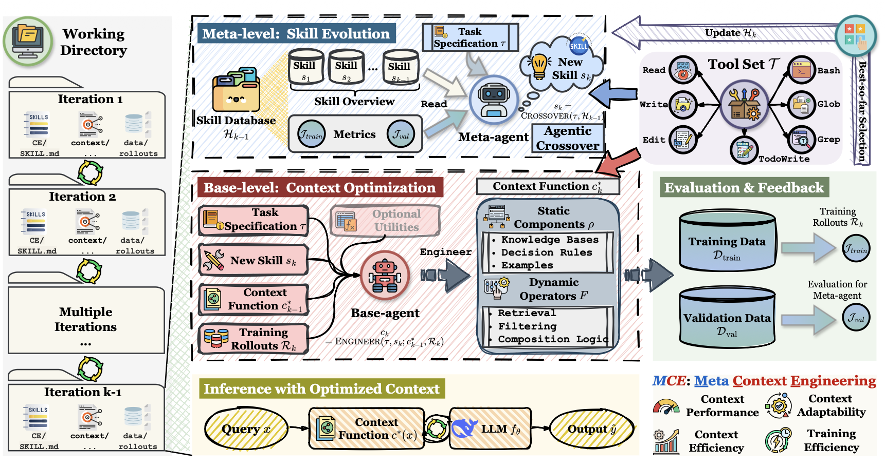
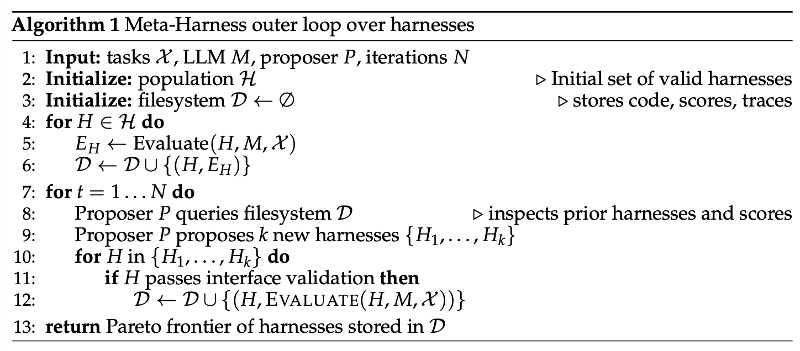
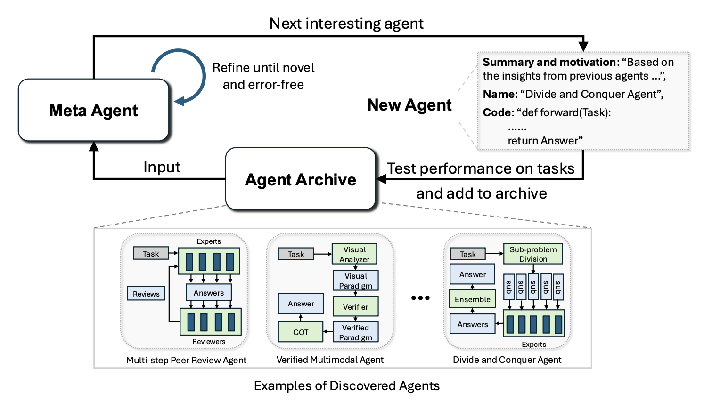
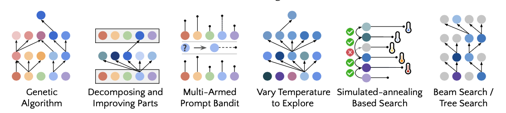
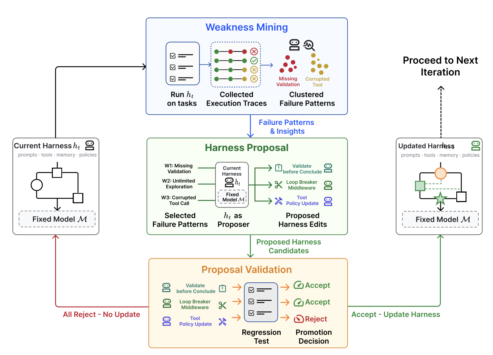

# 面向自我改进的 Harness 工程

> Harness Engineering for Self-Improvement

> 来源：Lil'Log / Lilian Weng，2026-07-04
> 原文链接：https://lilianweng.github.io/posts/2026-07-04-harness/
> 分类：AI Agent / Harness Engineering

## 核心要点

- 递归自我改进不只意味着模型直接改写自身权重，也可以通过改进训练管线与部署系统来产生更强的后继系统。
- Harness 是包围基础模型的外层运行框架，负责组织推理、规划、工具调用、上下文管理、状态存储和结果评估。
- 成功的编码智能体表明，模型能力之外的部署层和运行时设计，已经成为 AI 系统实际能力的重要组成部分。
- Harness 设计正在从早期“LLM + 记忆 + 工具 + 规划”扩展到工作流自动化、权限控制、评估、持久状态和多智能体后台任务。
- 上下文工程、工作流设计和自改进 harness 都可以被看作对模型外层执行环境的优化，而不仅是提示词工程。
- 多篇研究展示了用搜索、进化、反思、弱点挖掘和验证循环自动发现更好 harness 或工作流的可能性。
- 进化搜索系统如 AlphaEvolve、ShinkaEvolve 和相关方法，把模型、评测器、采样策略和程序变异组合成自动发现算法或科学结果的循环。
- 真正稳定的自我改进仍受限于评估、数据闭环、长期记忆、探索与利用、模型权重联合优化以及现实世界验证。
- 作者认为，harness 工程是理解现代 AI 自我改进路径的重要视角：模型本身重要，但模型外层的系统设计同样决定实际智能表现。

## 正文

递归自我改进（recursive self-improvement, RSI）这一概念可追溯至 [I. J. Good（1965 年）](https://philpapers.org/rec/GOOSCT)，他将“超智能机器”定义为一种能在所有智力活动中超越人类、并设计出更好的机器来改进自身的系统。[Yudkowsky（2008 年）](https://www.lesswrong.com/posts/JBadX7rwdcRFzGuju/recursive-self-improvement) 用“递归自我改进”一词描述了一个特定的反馈循环：AI 利用自身当前的智能来改进产生其智能的认知机制。

> The concept of **recursive self-improvement (RSI)** dates back to [I. J. Good (1965)](https://philpapers.org/rec/GOOSCT), where he defined an "ultraintelligent machine" as a system that can surpass humans in all intellectual activities and design better machines to improve itself. [Yudkowsky (2008)](https://www.lesswrong.com/posts/JBadX7rwdcRFzGuju/recursive-self-improvement) used the phrase "recursive self-improvement" for a specific feedback loop: an AI uses its current intelligence to improve the cognitive machinery that produces its intelligence.

现代 AI 中的这一反馈循环，可能意味着模型直接重写自己的权重，或者更广义地说，模型改进了*训练流水线（training pipeline）*和*部署系统（deployment system）*，进而催生出在具有经济价值的任务上表现更优的下一代模型。研究表明，前沿实验室的 AI 研发速度已大幅加快（[Anthropic](https://www.anthropic.com/institute/recursive-self-improvement)；[OpenAI](https://openai.com/index/how-agents-are-transforming-work/)）。

> This feedback loop in modern AI may indicate the model rewriting its own weights directly, or more broadly the model improves the *training pipeline* and the *deployment system*, which in turn enables a better successor model with improved performance across economically valuable tasks. The speed of research development in AI has been shown to drastically accelerated in frontier labs ([Anthropic](https://www.anthropic.com/institute/recursive-self-improvement); [OpenAI](https://openai.com/index/how-agents-are-transforming-work/)).

我明确提到“*部署系统*”，是因为原始模型与真实世界情境之间的这一层，似乎与模型的原始智能（即预训练之后立刻做的评测）同等重要。Harness（外层运行框架）是 AI 部署的重要组成部分，Claude Code 和 Codex 等成功的编程智能体产品便是例证。**Harness** 是围绕基础模型构建的系统，负责编排执行流程，决定模型如何思考与规划、如何调用工具与行动、如何感知与管理上下文、如何存储产物以及如何评估结果。

> I explicitly mention *"deployment system"* because the layer between the raw model and the real-world context seems to be as important as the model's raw intelligence (i.e. the evals right after pretraining). Harnesses are important components of AI deployment, as shown by successful coding agent products such as Claude Code and Codex. A **harness** is the system surrounding a base model that orchestrates execution and decides how the model thinks and plans, calls tools and acts, perceives and manages context, stores artifacts, and evaluates results.

这一篇文章将聚焦于 Harness 工程相关的研究，以及它如何推动递归自我改进。近期关于自动化研究、自我改进智能体和进化程序搜索（evolutionary program search）的大量工作都可以围绕这一问题展开组织。另有一些关于模型自我博弈、合成数据、测试时训练以及更广泛的持续学习主题的工作，同样契合递归自我改进的愿景（例如 [Yuan et al. 2024](https://arxiv.org/abs/2401.10020)、[Chen et al. 2024](https://arxiv.org/abs/2401.01335)、[Zhao et al. 2025](https://arxiv.org/abs/2505.03335)、[Choi et al. 2026](https://openreview.net/forum?id=lTbBFAoPSA)），但它们不是本文的重点。

> This one post will focus on research around harness engineering and how it contributes to RSI. Much recent work on auto-research, self-improving agents, and evolutionary program search can be organized around this question. Other work on model self-play, synthetic data, test-time training and a broader theme of continual learning also matches the RSI vision (e.g. [Yuan et al. 2024](https://arxiv.org/abs/2401.10020), [Chen et al. 2024](https://arxiv.org/abs/2401.01335)), [Zhao et al. 2025](https://arxiv.org/abs/2505.03335), [Choi et al. 2026](https://openreview.net/forum?id=lTbBFAoPSA))) but they will not be the focus of this post.

### Harness 设计模式
> Harness Design Patterns

与[早期智能体框架](https://lilianweng.github.io/posts/2023-06-23-agent/)中"智能体 = LLM + 记忆 + 工具 + 规划 + 行动"的定义相比，Harness（外层运行框架）工程还额外包含*工作流设计（例如循环工程）、评估、权限控制以及持久状态管理*。它不再只是提示词模板，而是更接近运行时和软件系统设计：模型如何观察、行动、记忆、自我检查并改进。

> Compared with [early agent frameworks](https://lilianweng.github.io/posts/2023-06-23-agent/), “agent = LLM + memory + tools + planning + action”, harnesses engineering additionally include *workflow design (e.g. loop engineering), evaluation, permission controls, and persistent state management*. It is no longer only prompt templates, but closer to runtime and software system design: how the model observes, acts, memorizes, checks itself, and improves.

这种设计应当刻意追求简洁和通用，以实现良好的泛化能力，很可能需要参考现有的软件工程实践，从而受益于预训练知识。操作系统与 Harness 之间也存在很强的类比关系。与操作系统类似，Harness 应当在封装复杂逻辑的同时保持接口的简洁。与此同时，配置、工具接口及其他协议也可能逐渐在整个行业中走向标准化。

> The design should be deliberately simple and generic to enable generalization, likely with reference to existing software engineering practices to benefit from prertaining knowlege. There is also a strong analogy between operating systems and harnesses. Similar to an OS, a harness should encapsulate complicated logic while keeping the interface simple. Meanwhile, configs, tool interfaces and other protocols may gradually become standardized across the industry.

#### 模式一：工作流自动化
> Pattern 1: Workflow Automation

为模型定义一个可以运行、测试并不断迭代的工作流，是实现自动化的关键设计。Karpathy 的 autoresearch 仓库（<https://github.com/karpathy/autoresearch>）就是这种工作流如何构建的一个清晰示例。一种常见的工作流遵循以目标为导向的循环：规划、执行、观察/测试、改进，然后再次执行——如此循环*直到*目标达成。这一过程可能会触发主动向用户发起的请求，以澄清任务规范或执行偏好。

> Defining a workflow in which the model can operate, test, and iterate is a key design for automation. Karpathy's autoresearch repo (<https://github.com/karpathy/autoresearch>) is a clean example of how such a workflow can be constructed. A common workflow follows a goal-oriented loop of plan, execute, observe/test, improve, and execute again *until* the goal is achieved. The process may trigger proactive requests to users for clarity in task specification or execution preference.

<figure>

<figcaption>一个简化的 Codex 智能体循环：智能体调用工具，工具响应会影响模型的下一次生成。<br />
（图片来源：<a href="https://openai.com/index/unrolling-the-codex-agent-loop/">OpenAI codex agent post</a>）</figcaption>
</figure>

> <figcaption>A simplified Codex agent loop: the agent calls tools and tool responses affect the model's next generation.<br />
> (Image source: <a href="https://openai.com/index/unrolling-the-codex-agent-loop/">OpenAI codex agent post</a>)</figcaption>

该工作流图还强调了模型对自身运行轨迹和失败案例的分析，并通过一个“智能体运行时（agent runtime）”而非静态提示词模板来持续改进其进展。

> The workflow graph also emphasizes the model analyzing its own trajectories and failure cases and then iterating on its progress through an "agent runtime" rather than a static prompt template.

#### 模式 2：文件系统作为持久记忆

> Pattern 2: File System as Persistent Memory

长周期智能体系统中反复出现的一个模式是：以简单的方式控制丰富的状态与产物。Harness（外层运行框架）不应把整个工作流和所有日志都放进上下文中；相反，它应该把持久状态保存在文件里。在长周期智能体执行过程中，诸如实验日志、代码差异、论文摘要、错误追踪和历史执行轨迹等产物，往往会远远超出模型训练所适应的上下文窗口长度。

> A recurring pattern in long-horizon agent systems is simple control over rich states and artifacts. A harness should not carry the entire workflow and all logs in context; instead, it should keep durable state in files. In long-horizon agentic rollout, artifacts such as experiment logs, code diffs, paper summaries, error traces, and past rollout trajectories often grow much longer than the context window that the model has trained for.

学习如何读取、写入和编辑文件系统（通常通过 `bash` 命令）是 LLM 的一项基础能力，因此以文件这种简单形式管理持久记忆，自然会随着核心模型能力的提升而受益。

> Learning how to read, write, and edit the file system (commonly via `bash` commands) is a foundation skill for LLMs, and thus managing persistent memory in the simple form of files naturally benefits from improvements in core model capability.

#### 模式 3：子智能体与后台任务
> Pattern 3: Sub-agent and Backend Jobs

Harness（外层运行框架）可以派生多个子智能体并行执行，同时监控后台任务。当主智能体需要搜索多个假设、并发运行实验，或委派独立子任务而不污染主上下文时，这一点非常有用。父智能体随后需要一个小型进程管理器：启动任务、检查日志、取消失败的运行，并将结果合并回主智能体线程。

> A harness can spawn multiple subagents to execute in parallel and monitor backend jobs. This is useful when the main agent needs to search multiple hypotheses, run experiments concurrently, or delegate isolated subtasks without polluting the main context. The parent agent then needs a small process manager: launch jobs, inspect logs, cancel failed runs, and merge results back into the main agent thread.

关键的设计选择是让并行性变得显式且可检查。如果子智能体的输出只存在于临时的聊天上下文中，它们很快就会过时且不可见。如果它们被存储为文件、日志和状态记录，模型就能在中断后恢复，并对自己的执行历史进行推理。

> The key design choice is to make parallelism explicit and inspectable. If subagent outputs only live in a transient chat context, they quickly become obselete and hidden. If they are stored as files, logs, and status records, the model can recover after interruptions and reason over its own execution history.

#### 案例研究：编程智能体 Harness
> Case study: Coding Agent Harness

主流编程智能体的核心接口已经在 Claude Code、Codex、OpenCode 以及类 Cursor 智能体之间趋于稳定统一。它们通常采用如下循环：

> The core interface of mainstream coding agents has become stabilized across Claude Code, Codex, OpenCode, and Cursor-style agents. They commonly use a loop like:

<figure>

</figure>

借助一组可用工具，编程智能体能够在给定仓库中开发和调试问题，这与人类开发者配备 IDE 的方式类似。

> With access to a set of tools, the coding agent is able to develop and debug issues in a given repository, similar to how human developers are equipped with IDEs.

（并非详尽列表，仅作示例展示。感兴趣可阅读[这里](https://github.com/yasasbanukaofficial/claude-code)。）

> (Not a comprenhensive list; shown for demonstration. Read [this](https://github.com/yasasbanukaofficial/claude-code) if interested.)

<table>
<colgroup>
<col style="width: 50%" />
<col style="width: 50%" />
</colgroup>
<thead>
<tr>
<th>分组</th>
<th>工具定义</th>
</tr>
</thead>
<tbody>
<tr>
<td>文件系统</td>
<td>- 文件发现：<code>glob</code>、<code>grep</code>、<code>ls</code><br />
- 文件读取：<code>read</code>、<code>read_many</code><br />
- 文件修改：<code>write</code>（整个新文件）；<code>edit</code>（字符串精确匹配替换）；<code>multi_edit</code>；<code>apply_patch</code>（应用结构化补丁/diff）</td>
</tr>
<tr>
<td>Shell 执行</td>
<td>运行命令：<code>bash</code>、<code>PowerShell</code></td>
</tr>
<tr>
<td>IO</td>
<td><code>lsp</code>、git 工具如 <code>git_status</code>、<code>git_diff</code>、<code>git_commit</code></td>
</tr>
<tr>
<td>外部上下文</td>
<td>MCP 工具、Skills</td>
</tr>
<tr>
<td>网络搜索</td>
<td><code>web_search</code>、<code>web_fetch</code>、浏览器工具</td>
</tr>
<tr>
<td>制品（Artifacts）</td>
<td>读取文档、图片；生成 HTML、图片</td>
</tr>
<tr>
<td>后台进程</td>
<td>例如：<code>CronCreate</code>、<code>CronDelete</code>、<code>CronList</code></td>
</tr>
<tr>
<td>智能体委派</td>
<td>例如：<code>spawn_agent</code>、<code>resume_agent</code>、<code>wait_agent</code>、<code>list_agents</code>、<code>close_agent</code>、<code>interrupt_agent</code> 等</td>
</tr>
</tbody>
</table>

#### Harness 层与核心智能之争？

> Harness Layer vs Core Intelligence?

很难预测递归自我改进（RSI）的未来在多大程度上依赖于 Harness（外层运行框架）工程，但 RSI 的近期路径不太可能一上来就是模型直接改写自己的权重。我对近期实际路径的预测是：

> It is hard to forecast how much the future of RSI will rely on harness engineering, but the near-term path of RSI is unlikely to start as a model directly rewriting its weights. My prediction of a practical near-term path is:

1. Harness 工程会朝着元方法论的方向演化（即改进"获得更好答案的机制"，而不仅仅是改进答案本身）。Harness 系统本身会成为一个优化目标，启发式规则更少，通用机制更多。
2. 反过来，成熟的 Harness 使模型自我改进循环的自动化研究成为可能，而更聪明的模型能防止 Harness 被过度工程化，从而保持系统的可持续性。

> • Harness engineering will evolve in the direction of meta-methodology (i.e. improving the machinery for getting better answers, not just improving the answer itself). The harness system itself becomes an optimization target, with fewer heuristic rules and more general mechanisms.
> • In turn, mature harnesses enable auto-research for model self-improvement loop and smarter models prevents harnesses from overengineering and keep the system sustainable.

最终，许多 Harness 层面的改进有可能被*内化*到核心模型行为中，但与外部上下文和工具的接口应当保留。我们已经在[提示工程](https://lilianweng.github.io/posts/2023-03-15-prompt-engineering/)中见过这种模式的一个较温和版本：随着指令微调和模型推理能力的提升，人工的提示技巧变得不再那么关键，但*指定目标、约束、上下文和评估的需求并没有消失*。

> Eventually it is possible that many harness improvements will be *internalized* into core model behavior, but the interface with external context and tools should remain. We have seen a softer version of this pattern with [prompt engineering](https://lilianweng.github.io/posts/2023-03-15-prompt-engineering/): manual prompt tricks became less central as instruction tuning and model reasoning improved, but *the need to specify goals, constraints, context, and evaluation did not disappear*.

### Harness 优化

> Harness Optimization

Harness（外层运行框架）系统中被优化的对象，其演进大致遵循这样的路径：指令[提示词](https://lilianweng.github.io/posts/2023-03-15-prompt-engineering/) → 结构化上下文 → 工作流 → Harness 代码 → 优化器代码。随着模型变得更加智能和强大，我们会转向更复杂的目标和更通用的方法。

> The progression in the object being optimized in the harness system is roughly: instruction [prompts](https://lilianweng.github.io/posts/2023-03-15-prompt-engineering/) → structured context → workflow → harness code → optimizer code. As the model becomes more intelligent and powerful, we move toward more complex targets and generic methods.

#### 上下文工程

> Context Engineering

如果只是把所有工具响应和模型生成结果不断追加进上下文，随着智能体任务的时间跨度显著增加，上下文会迅速失控。上下文管理是一层用于为大语言模型构建更结构化、更简洁上下文并管理持久状态的机制。毫无疑问，长上下文研究会持续取得进展，但目前长上下文智能与上下文工程有时会交织在一起。

> Simply appending all the tool responses and model generations into the context can quickly grow out of control as the agentic job horizon increases significantly. Context management is a layer to construct a more structed and concise context for LLM and manage persistant states. There is no doubt that long-context research will keep on making progress but at the moment long-context intelligence and context engineering sometime intertwines.

**Agentic Context Engineering**（ACE；[Zhang et al. 2025](https://arxiv.org/abs/2510.04618)）将上下文视为一本不断演化的playbook，而不是一段越来越长的提示词。它包含三个组件，共同维护一本由要点条目组成的上下文playbook，每条都有标识符和描述。

> **Agentic Context Engineering** (ACE; [Zhang et al. 2025](https://arxiv.org/abs/2510.04618)) treats context as an evolving playbook rather than an increasingly lengthening prompt. It has three components to maintain one context playbook of bullet points, each with an identifier and a description.

1. *生成器（Generator）*：参照要点条目生成任务轨迹。
2. *反思器（Reflector）*：从成功与失败的轨迹中提炼洞见。
3. *策展器（Curator）*：以增量、逐条的方式更新结构化上下文。

> • *Generator*: produces task trajectories, with reference to bullet points.
> • *Reflector*: distills insights from successful and failed trajectories.
> • *Curator*: updates the structured context with incremental, itemized entries.

<figure>

<figcaption>The framework of Agentic Context Engineering (ACE). (Image source: <a href="https://arxiv.org/abs/2510.04618">Zhang et al. 2025</a>)</figcaption>
</figure>

为了防止在迭代重写过程中出现上下文坍缩和简略化偏差，ACE 的一个关键设计选择是：策展器不会重写整段提示词。它只输出一组结构化的、逐条列出的要点，形式为（标识符、描述），这些要点通过确定性逻辑合并进一本结构化的上下文日志。上下文条目会被定期精炼与去重。

> To prevent context collapse and brevity bias during iterative rewrites, one key design choice in ACE is that the curator does not rewrite a full prompt blob. It instead outputs a collection of structured, itemized bullets in the form of (identifier, description), and these bullets are merged into a structured context logbook with deterministic logic. The context items are refined and deduplicated periodically.

ACE 能从rollout中学习洞见，这有助于我们迈向自管理记忆，但更新规则和整体工作流仍然是手工设计的。为了迈向一个更加自我改进的循环，**Meta Context Engineering**（MCE；[Ye et al. 2026](https://arxiv.org/abs/2601.21557)）将机制（如何管理上下文）与产物内容（上下文中是什么）分离开来，在元优化层面运行技能演化，在基础层面运行上下文优化。

> The fact that ACE learns insights from rollouts helps us move toward self-managed memory, but the update rules and the overall workflow are still handcrafted. To move toward a more self-improving loop, **Meta Context Engineering** (MCE; [Ye et al. 2026](https://arxiv.org/abs/2601.21557)) separates the mechanism (how to manage context) from the artifact content (what is in context), running skill evolution at the meta-optimization level and context optimization at the base level.

一个 MCE 技能 $s \in \mathcal{S}$ 定义了一个上下文函数 $c_s=(\rho_s,F_s)$，并将输入 $x$ 映射为上下文 $c = F_s(x;\rho_s)$，其中：

- $\rho_s = \{\rho_1,\dots,\rho_m\}$ 是静态组件（提示词、知识库、代码库）。
- $F_s = \{F_1,\dots,F_k\}$ 是动态算子（检索、筛选、过滤、格式化）。

> An MCE skill $s \in \mathcal{S}$ defines a context function $c_s=(\rho_s,F_s)$ and maps an input $x$ to context $c = F_s(x;\rho_s)$, where:
>
> • $\rho_s = \{\rho_1,\dots,\rho_m\}$ are static components (prompts, knowledge bases, code libraries).
> • $F_s = \{F_1,\dots,F_k\}$ are dynamic operators (search, selection, filtering, formatting).

双层优化的目标是：在给定技能 $s$ 的情况下，在训练数据上找到最佳上下文 $c_s^*$；而外层循环则寻找能在验证集上取得最佳表现的最优技能：

> The bi-level optimization is to find the best context $c_s^*$ given skill $s$ on the training data, while the outer loop finds the optimal skill that provides the best performance on the validation set:

<div>

$$ \text{Inner: }c_s^*=\arg\max_{c_s}J_\text{train}(c_s;s)\quad \text{Outer: }s^*=\arg\max_{s\in\mathcal{S}}J_\text{val}(c_s^*) $$

</div>

技能数据库会追踪以往技能、上下文函数以及评估指标的历史记录 $\mathcal{H}_{k-1} = \{(s_i,c_i,J_i^\text{train}, J_i^\text{val})\}_{i=1}^{k-1}$。一个元级智能体会对以往技能执行智能体化的[交叉操作（crossover）](https://en.wikipedia.org/wiki/Crossover_(evolutionary_algorithm))，在给定任务 $\tau$ 的情况下创造出新技能：$s_k=\text{crossover}(\tau,\mathcal{H}_{k-1})$。

> The skill database tracks the history of previous skills, context functions and eval metrics $\mathcal{H}_{k-1} = \{(s_i,c_i,J_i^\text{train}, J_i^\text{val})\}_{i=1}^{k-1}$. A meta-level agent performs agentic [crossover](https://en.wikipedia.org/wiki/Crossover_(evolutionary_algorithm)) over prior skills to create a new skill given a task $\tau$: $s_k=\text{crossover}(\tau,\mathcal{H}_{k-1})$.

随后，一个基础层的上下文工程师会执行技能 $s_k$，并在当前技能的指导下，从rollout反馈 $\mathcal{R}_k$ 中学习该上下文函数：$c_k=\text{engineer}(\tau,s_k;c_{k-1}^*,\mathcal{R}_k)$。

> Then a base-level context engineer executes the skill $s_k$ and learns the context function from rollout feedback $\mathcal{R}_k$, guided by the current skill: $c_k=\text{engineer}(\tau,s_k;c_{k-1}^*,\mathcal{R}_k)$.

<figure>

<figcaption>The framework of Meta Context Engineering (MCE): meta-level skill evolution searches over context-management mechanisms, while the base level optimizes the task context. (Image source: <a href="https://arxiv.org/abs/2601.21557">Ye et al. 2026</a>)</figcaption>
</figure>

MCE 不像 ACE 那样强制规定上下文的结构化启发式规则。它使用*自由形式的技能（free-form skills）*来存储任务中最重要的知识，并将技能与技能条件下的上下文一起迭代演化。在实现层面，一个上下文函数 $c$ 被实例化为一个专用目录下的一组文件，既包括静态组件（`skill.md`），也包括动态组件（上下文与数据rollout）。元级和基础级的优化都在具备一套标准工具集的智能体化编码环境中执行，

> MCE does not enforce a heuristic rule for how to structure context as ACE does. It uses *free-form skills* to store the most important knowledge for a task, and evolves the skill and the skill-conditioned context iteratively together. Implementation-wise, a context function $c$ is instantiated as a collection of files in a dedicated directory, including both static (`skill.md`) and dynamic (context and data rollouts) components. Both meta-level and base-level optimization are executed in agentic coding envs with a standard tool set,

<div>

$$ \mathcal{T}=\{\texttt{Read},\texttt{Write},\texttt{Edit},\texttt{Bash},\texttt{Glob},\texttt{Grep},\texttt{TodoWrite}\} $$

</div>

**Meta-Harness**（[Lee et al. 2026](https://arxiv.org/abs/2603.28052)）又向前推进了一层：其优化对象是决定并优化应向模型存储、检索和呈现哪些信息的*代码*本身。其名称中的"Meta-"意味着它是一个用于优化Harness（外层运行框架）的Harness。

> **Meta-Harness** ([Lee et al. 2026](https://arxiv.org/abs/2603.28052)) moves another level deeper: the optimized object is the *code* that determines and optimizes what information should be stored, retrieved, and presented to the model. “Meta-” in its name means it is a harness for optimizing harnesses.

<figure>

<figcaption>The Meta-Harness outer-loop optimization algorithm. (Image source: <a href="https://arxiv.org/abs/2603.28052">Lee et al. 2026</a>)</figcaption>
</figure>

负责创建新Harness的提议者本身就是一个编码智能体，最终输出是一组位于帕累托前沿（Pareto frontier）上的候选Harness。

> The proposer for creating a new harness is itself a coding agent and the final output is a collection of harness candidates on the Pareto frontier.

- 整个执行历史都可以通过文件系统访问，因此编码智能体会使用 `grep` 或 `cat` 这类命令来通读它，而不是把所有内容一股脑塞进单一的提示词上下文。
- 被提议的Harness是文件系统中的一个目录，包含其自身的源代码、评分、rollout轨迹和状态更新。
- Meta-harness循环会迭代地创建新Harness，只有合格的才会被保留。

> • The entire execution history is accessible via a file system, and thus the coding agent uses commands like `grep` or `cat` to read through it instead of shoveling everything into a single prompt context.
> • The proposed harness is a dictionary in the file system containing its own source code, scores, rollout trajectories, and state updates.
> • The mete-harness loop iteratively creates new harnesses, and only qualified ones are kept.

<figure>

<figcaption>The performance of Meta-Harness on (Left) text classification with a small number of iterations and (Right) TerminalBench-2. Note that the search in the TerminalBench-2 experiment is initialized from Terminus-KIRA and Terminus-2, two very strong harnesses. (Image source: <a href="https://arxiv.org/abs/2603.28052">Lee et al. 2026</a>)</figcaption>
</figure>

尽管如此，其中重要的一课很清楚：一旦Harness设计变成一个可执行的搜索空间，一个强大的编码智能体就能利用与人类工程师相同的设计空间。

> Still, the important lesson is clear: once harness design becomes an executable search space, a strong coding agent can exploit the same design space human engineers use.

#### 工作流设计
> Workflow Design

Harness 工程中的工作流设计可以由领域专家手工打造。以自动化研究（auto-research）为例，已有多种框架被提出并测试。**AI Scientist** 系统（[Lu et al. 2026](https://www.nature.com/articles/s41586-026-10265-5)）构建了一条流水线，用于提出研究想法、编写代码、运行实验、分析结果、撰写论文并执行同行评审。[Meng et al.（2026）](https://arxiv.org/abs/2605.26340)在 **ScientistOne** 中将可验证性作为核心设计约束，其中每一项声明（引用、数值、方法论、结论）都必须能追溯到证据来源，并由 Chain-of-Evidence（证据链）检查进行审计。

> Workflow design in harness engineering can be handcrafted by domain experts. Taking auto-research as an example, various frameworks have been proposed and tested. The **AI Scientist** system ([Lu et al. 2026](https://www.nature.com/articles/s41586-026-10265-5)) builds a pipeline to propose research ideas, write code, run experiments, analyze results, write a manuscript, and perform peer review. [Meng et al. (2026)](https://arxiv.org/abs/2605.26340) make verifiability the central design constraint in **ScientistOne**, where every claim (citation, numerical, methodological, conclusion) must trace to an evidence source and is audited by Chain-of-Evidence checks.

<figure>

<figcaption>AI Scientist pipeline for idea generation, experimentation, paper writing, and review. (Image source: <a href="https://www.nature.com/articles/s41586-026-10265-5">Lu et al. 2026</a>)</figcaption>
</figure>

**Autodata** 智能体（[Kulikov et al. 2026](https://arxiv.org/abs/2606.25996)）被设计为扮演数据科学家的角色，用于生成训练和评估数据。主智能体管理一个提出问题的 *challenger（出题者）*、一个 *weak solver（弱解答者）*、一个 *strong solver（强解答者）* 和一个 *verifier/judge（验证者/评判者）*，目标是把数据合成到“恰到好处”的难度水平，即强解答者能成功而弱解答者会失败。

> The **Autodata** agent ([Kulikov et al. 2026](https://arxiv.org/abs/2606.25996)) is designed to work as a data scientist for generating training and evaluation data. The main agent manages a *challenger* that proposes problems, a *weak solver*, a *strong solver*, and a *verifier/judge*, aiming to synthesize data at the “just right” level of difficulty, meaning that the strong solver succeeds but the weak solver fails.

在 Autodata 中，challenger 的 prompt 会根据 solver 和 verifier 的反馈进行迭代更新。这里的局限在于，合成的任务被用于微调弱解答者，而非强解答者；如果这个循环无法迭代式地改进强模型，那么它更像是在一个生成的 prompt 分布上做间接蒸馏，而不太具备 RSI（递归自我改进）的味道。

> In Autodata, the challenger prompt is updated iteratively according to feedback from the solvers and verifier. The limitation here is that synthesized tasks are used to fine-tune weak solvers but not strong solvers; if the loop cannot iteratively improve the strong model, it is more like indirect distillation over a generated prompt distribution, with less RSI flavor.

<figure>

<figcaption>Autodata agentic workflow design for generating synthetic training and evaluation data around challenger, solver, and verifier roles. (Image source: <a href="https://arxiv.org/abs/2606.25996">Kulikov et al. 2026</a>)</figcaption>
</figure>

Workflow 的设计空间*极其庞大*，很自然地，我们可以把工作流设计看作一个搜索问题，因此应该能够依靠算法而不仅仅是手工打造来找到好的方案。沿着这个方向，**Automated Design of Agentic Systems**（自动化智能体系统设计，ADAS；[Hu et al. 2025](https://arxiv.org/abs/2408.08435)）将智能体设计本身表述为一个优化问题——“meta-agent search（元智能体搜索）”，即由一个元智能体来提出新的智能体工作流设计。

> The design space for workflow is *enormous*, and naturally we can think of workflow design as a search problem, and therefore we should be able to find good solutions by algorithms rather than only manually craft them. Following this direction, **Automated Design of Agentic Systems** (ADAS; [Hu et al. 2025](https://arxiv.org/abs/2408.08435)) formulates agent design itself as an optimization problem, “meta-agent search” where a meta-agent proposes new designs of agentic workflows.

1.  用简单智能体（如 CoT 和 self-refine）初始化一个智能体工作流的档案库（archive）。
2.  让元智能体参考档案库中已有的方案，全部以*代码*形式编写新的智能体。
    - 元智能体首先生成新工作流的高层描述，然后再用代码实现它。
    - 该草稿程序随后会经过元智能体的两轮 self-refine 步骤（即让模型给出反馈，再让同一模型根据反馈修改之前生成的输出；[Madaan et al. 2023](https://arxiv.org/abs/2303.17651)），以检验其新颖性。
3.  评估每个新候选方案，并将成功的方案加回档案库。
4.  重复步骤 2-3，直到达到最大迭代次数。

> • Initialize an archive of agentic workflows with simple agents such as CoT and self-refine.
> • Ask a meta-agent to program new agents, all in *code*, inspired by existing solutions in the archive.
> • The meta-agent first generates a high-level description of the new workflow, and then implements it in code.
> • The draft program then goes through two self-refine steps (i.e. ask the model to provide feedback and then ask the same model to refine the previously generated outputs based on the feedback; [Madaan et al. 2023](https://arxiv.org/abs/2303.17651)) by the meta-agent to check its novelty.
> • Evaluate each new candidate and add successful ones back to the archive.
> • Repeat steps 2-3 until the maximum iteration count is reached.

<figure>

<figcaption>Illustration of Automated Design of Agentic Systems (ADAS).<br />
(Image source: <a href="https://arxiv.org/abs/2408.08435">Hu et al. 2025</a>)</figcaption>
</figure>

**AFlow**（[Zhang et al. 2025](https://arxiv.org/abs/2410.10762)）将智能体工作流表示为一个图，其中节点代表调用 LLM 的动作，边则以代码实现逻辑操作。该工作流优化依赖 [MCTS](https://en.wikipedia.org/wiki/Monte_Carlo_tree_search)（蒙特卡洛树搜索）：

> **AFlow** ([Zhang et al. 2025](https://arxiv.org/abs/2410.10762)) represents an agentic workflow as a graph, where nodes represent LLM-invoking actions and edges implement logical operations in code. The workflow optimization relies on [MCTS](https://en.wikipedia.org/wiki/Monte_Carlo_tree_search) (Monte Carlo Tree Search):

1.  用一个模板在树中初始化起始工作流 $W_0$。
2.  用得分与均匀探索的软混合策略选择一个工作流节点。
3.  让 LLM 根据其评估表现生成一个改进后的工作流，以此对其进行扩展。
4.  执行并评估新的工作流。
5.  如果新工作流在 $N$ 轮预算内表现出改进，则将其加回树中。
6.  重复步骤 2-5，当 top-$k$ 平均得分趋于平稳或达到预算上限时停止。

> • Initialize the starting workflow $W_0$ in the tree with a template.
> • Select a workflow node using a soft mixture of score and uniform exploration.
> • Expand it by asking an LLM to produce a modified workflow conditioned on its evaluation performance.
> • Execute and evaluate the new workflow.
> • Add it back to the tree if the new workflow shows improvement within a budget of $N$ rounds.
> • Repeat steps 2-5 and stop when the top-$k$ average score plateaus or hit the budget.

<figure>

<figcaption>AFlow optimization process over a tree of workflow candidates. (Image source: <a href="https://arxiv.org/abs/2410.10762">Zhang et al. 2025</a>)</figcaption>
</figure>

AFlow 在问答（QA）、代码和数学任务上的实验表明，相较于手工设计的工作流和 ADAS，AFlow 有相当可观的提升。

> Experiments of AFlow in QA, code, and math tasks showed decent improvement of AFlow over manually designed workflows and ADAS.

<figure>

<figcaption>AFlow experiments in comparison to manual methods and ADAS. (Image source: <a href="https://arxiv.org/abs/2410.10762">Zhang et al. 2025</a>)</figcaption>
</figure>

#### 自我改进型 Harness

> Self-Improving Harness

上下文工程或工作流设计都只是 Harness 的一部分。我们需要在整个设计空间中搜索，并同时优化上下文管理逻辑、工作流、权限以及其他许多 Harness 组件。正如我们在 Meta-Harness、ADAS 和 AFlow 等工作中所看到的，**✨代码✨** 是定义程序和系统的**通用语言**。简单来说，Harness 就是编排提示词、工具调用、子智能体、控制流、记忆和工作流逻辑如何协同工作的代码。如果一个 LLM 能够优化执行智能体的代码，那么它能够触及的设计空间会*远大于*手写提示词所能触及的范围。

> Either context engineering or workflow design is only one part of a harness. We need to search through the entire design space and optimize context-management logic, workflow, permissions, and many other harness components together. As we have seen in work like Meta-Harness, ADAS, and AFlow, **✨code✨** is a **universal language** for defining programs and systems. In simple words, a harness is code that programs how prompts, tool calls, subagents, control flow, memory, and workflow logic work together. If an LLM can optimize the code that executes agents, it can access a *much larger design space* than hand-written prompts.

**Self-Taught Optimizer**（STOP；[Zelikman et al. 2023](https://arxiv.org/abs/2310.02304)）是递归式脚手架改进的早期范例之一。在第 $t=0$ 步的种子改进器 $I_0$ 接受一个初始解 $s$、一个效用函数 $u$ 以及一个黑盒语言模型 $M$，并返回一个改进后的解 $s'$，即 $s' = I(u, s; M)$。STOP 的目标并不是直接改进 $s$，而是*改进改进器 $I$ 本身*。

> **Self-Taught Optimizer** (STOP; [Zelikman et al. 2023](https://arxiv.org/abs/2310.02304)) is one of the early examples of recursive scaffolding improvement. A seed improver $I_0$ at step $t=0$ takes an initial solution $s$, a utility function $u$, and a black-box language model $M$, and returns an improved solution $s’$, that is, $s’ = I(u, s; M)$. The goal of STOP is not directly to improve $s$ but *to improve the improver $I$ itself*.

首先，我们将元效用（meta-utility）定义为给定改进器函数 $I$ 在一组下游任务 $\mathcal{D}$ 上的平均效用：

> First, let’s define the meta-utility as the average utility of a given improver function $I$ over a collection of downstream tasks $\mathcal{D}$:

<div>

$$ \hat{u}(I) \triangleq \frac{1}{\vert\mathcal{D}\vert}\mathbb{E}_{(u,s)\sim \mathcal{D}}[u(I(u,s; M))] $$

</div>

由于改进"改进器函数"本身也是一个优化问题，我们可以通过自我改进更新，根据 $I_{t-1}$ 由元效用衡量的表现，递归地得到 $I_t$ 的新版本：

> Because improving the improver function is an optimization problem itself, we can recursively get a new version of $I_t$ based on $I_{t-1}$’s performance measured by meta-utility via a self-improvement update:

<div>

$$ I_t=I_{t-1}(\hat{u},I_{t-1};M) $$

</div>

<figure>

<figcaption>Self-Taught Optimizer（STOP）算法。（图片来源：<a href="https://arxiv.org/abs/2310.02304">Zelikman et al. 2023</a>）</figcaption>
</figure>

> <figcaption>Algorithm of Self-Taught Optimizer (STOP). (Image source: <a href="https://arxiv.org/abs/2310.02304">Zelikman et al. 2023</a>)</figcaption>

在 Zelikman 等人（2023）的实验中，被改进后的改进器发现了多种策略，例如遗传算法、分解并改进各部分、多臂提示词赌博机（multi-armed prompt bandits）、模拟退火、变化温度参数以及 beam/tree 搜索。这与 Harness 工作流可以被表示为一个可优化的对象是类似的道理。

> In Zelikman et al. (2023)’s experiments, the improved improver discovered various strategies, such as genetic algorithms, decomposing and improving parts, multi-armed prompt bandits, simulated annealing, varying temperature, and beam/tree search. This is analogous to how a harness workflow can be represented as an object for optimization.

<figure>

<figcaption>STOP 发现的自我改进策略示例。（图片来源：<a href="https://arxiv.org/abs/2310.02304">Zelikman et al. 2023</a>）</figcaption>
</figure>

> <figcaption>Examples of self-improvement strategies discovered by STOP. (Image source: <a href="https://arxiv.org/abs/2310.02304">Zelikman et al. 2023</a>)</figcaption>

他们研究结果中一个*需要警惕*的发现是：STOP 在 GPT-4 上随着迭代提升了平均下游表现，但在 GPT-3.5 和 Mixtral 等较弱模型上却出现了退化。仅有递归结构是不够的，基础模型必须*具备足够的能力*才能改进这一机制。这意味着 Harness 改进能让模型的部署更好，但智能本身仍然是核心。

> A *cautionary* result in their findings is that STOP improved mean downstream performance across iterations with GPT-4 but degraded with weaker models like GPT-3.5 and Mixtral. Recursive structure alone is not enough. The base model must be *capable enough* to improve the mechanism. This implies that harness improvement enables better deployment of the model but intelligence is still the core.

一项更新的工作 **Self-Harness**（[Zhang et al. 2026](https://arxiv.org/abs/2606.09498)）依靠 LLM 智能体通过一个"提出—评估—接受"循环来改进自身的 Harness。

> A more recent work, **Self-Harness** ([Zhang et al. 2026](https://arxiv.org/abs/2606.09498)), relies on LLM agents to improve their own harness via a propose-evaluate-accept loop.

<figure>

<figcaption>Self-Harness 通过弱点挖掘、受限 Harness 提议和验证的循环来更新 Harness。（图片来源：<a href="https://arxiv.org/abs/2606.09498">Zhang et al. 2026</a>）</figcaption>
</figure>

> <figcaption>Self-Harness uses a loop of weakness mining, bounded harness proposal, and validation to update a harness. (Image source: <a href="https://arxiv.org/abs/2606.09498">Zhang et al. 2026</a>)</figcaption>

Self-Harness 的循环包含三个阶段：

> The loop in Self-Harness has three stages:

1.  *弱点挖掘*：将失败案例聚类为由验证器支撑的失败模式。
    - 当前 Harness $h_t$ 被用于任务评估，执行轨迹被收集用于分析。
    - 需要注意的是，两次运行在表层的错误日志中可能共享相同的验证器结果（例如超时或缺失产物），但背后的因果机制却各不相同。因此我们需要一份信息丰富的失败记录，其中包含终端验证器层面的原因、相关智能体行为的因果状态，以及轨迹所暴露出的抽象智能体机制，以便揭示根本原因。
2.  *Harness 提议*：基于挖掘出的失败模式，提出受限范围的 Harness 编辑。
    - 同一模型在 $h_t$ 下被调用，充当提议者角色。
    - 该模型会被提供一个受限的提议上下文：（1）当前 Harness 的可编辑面，（2）来自评估系统的、由验证器支撑的失败模式，（3）应当保留的通过行为记录，以及（4）此前尝试过的编辑摘要。
    - Harness 编辑应优先针对那些可被解决的（例如非任务特定难度的）重复出现的错误模式，且可以通过狭窄范围的改动来解决。
    - 候选 Harness 编辑之间应彼此不同且多样化。
3.  *提议验证*：验证并合并合格的编辑，从而创建新的 Harness $h_{t+1}$。
    - 候选编辑会通过在保留内（held-in）$D_\text{in}$（用于测试弱点是否已解决）和保留外（held-out）$D_\text{out}$（用于检查是否引入了其他未知问题）数据集上的回归测试来评估。
    - 只有在保留内和保留外数据上都没有出现回归的候选编辑才会被接受。
    - 被接受的候选编辑会被合并以将 Harness 更新为 $h_{t+1}$，而被拒绝的候选编辑则会被记录下来，但不会改变当前生效的 Harness。

> • *Weakness mining*: cluster failures into verifier-grounded failure patterns.
> • The current harness $h_t$ is used to evaluate on tasks and execution traces are collected for analysis.
> • Note that two runs can share the same verifier outcome in the error logs on the surface, such as timeout or missing artifact, while having different causal mechanisms. Therefore we need a failure record of rich information, containing the terminal verifier-level cause, the causal status of the relevant agent behavior, and the abstract agent mechanism exposed by the trace, to uncover the root causes.
> • *Harness proposal*: propose bounded harness edits based on mined failure patterns.
> • The same model is invoked under $h_t$ as a proposer.
> • The model is provided with a bounded proposal context: (1) the editable surfaces of the current harness, (2) the verifier-grounded failure patterns from the evaluation system, (3) records of passing behaviors that should be preserved, and (4) summaries of previously attempted edits.
> • Harness edits should prefer recurrent error patterns that are addressable (e.g. not task-specific difficulty) and can be resolved by narrow changes.
> • Harness edit candidates should be distinct and diverse.
> • *Proposal validation*: validate and merge qualified edits to create a new harness $h_{t+1}$.
> • Candidate edits are evaluated by regression tests on held-in $D_\text{in}$ (for testing whether the weakness is resolved) and held-out $D_\text{out}$ (for checking whether other unknown issues were introduced) splits.
> • Candidates are accepted only if they have no regression on both held-in and held-out data.
> • Accepted candidates are merged to update the harness to $h_{t+1}$, while rejected candidates are logged without changing the active harness.

在对 `MiniMax M2.5`、`Qwen3.5-35B-A3B` 和 `GLM-5` 运行 Terminal-Bench-2 时，Self-Harness 被证明能够学习到针对不同基础模型不同弱点的、模型特定的 Harness 指令，并提升保留外数据上的通过率。

> When running `MiniMax M2.5`, `Qwen3.5-35B-A3B`, and `GLM-5` on Terminal-Bench-2, Self-Harness was shown to learn model-specific harness instructions that target at different weaknesses of different base models and improve held-out pass rates.

Self-Harness 这类工作确实引发了我的担忧：如果允许一个程序去编辑操作系统层面的内容，抽象边界就会被打破。可编辑面需要经过妥善设计，权限控制和安全层需要独立于这一循环之外运作。围绕[奖励黑客（reward hacking）](https://lilianweng.github.io/posts/2024-11-28-reward-hacking/)的所有挑战依然存在。

> Self-harness type of work does raise my concerns that if a program is allowed to edit the OS system, abstraction boundaries are broken. The editable surface needs to be properly designed and the permission control and security layers need to live outside this loop. All the challenges around [reward hacking](https://lilianweng.github.io/posts/2024-11-28-reward-hacking/) still remain.

#### 进化搜索
> Evolutionary Search

进化搜索是一种受自然选择启发的优化方法（参见我之前关于[进化算法](https://lilianweng.github.io/posts/2019-09-05-evolution-strategies/)的文章）。它通过变异来演化一组解决方案，只保留群体中“适应度”高的那些。当（1）搜索空间庞大或形状怪异；以及（2）难以直接用梯度优化但容易评估解决方案时，进化搜索就能派上用场。Harness（外层运行框架）搜索在这里似乎是一个不错的契合场景。

> Evolutionary search is an optimization method inspired by natural selection (see my old post on [evolutionary algorithm](https://lilianweng.github.io/posts/2019-09-05-evolution-strategies/)). It evolves a population of solutions by mutating them and only keeping those with high “fitness” in the crowd. Evolutionary search comes in handy when (1) the search space is extensive or weirdly shaped; and (2) it is hard to optimize directly with gradients but easy to evaluate solutions. Harness search seems to be a good fit here.

进化搜索在以往的研究中已被用于提示工程。**Promptbreeder**（[Fernando et al. 2023](https://arxiv.org/abs/2309.16797)）通过一整套丰富的变异操作来优化任务特定的提示，有趣的是，变异提示本身（即指示 LLM 如何变异任务提示的指令）也通过进化得到改进。**GEPA**（[Agrawal et al. 2025](https://arxiv.org/abs/2507.19457)）将基于[反思](https://lilianweng.github.io/posts/2023-06-23-agent/#self-reflection)的提示与进化搜索相结合，利用对试错轨迹的自然语言反思来提出提示更新方案。

> Evolutionary search has been used in prompt engineering in the past studies. **Promptbreeder** ([Fernando et al. 2023](https://arxiv.org/abs/2309.16797)) optimizes task-specific prompts through a rich set of mutation operations, and interestingly the mutation prompts (i.e. instructions to an LLM to mutate a task prompt) are themselves also improved through evolution. **GEPA** ([Agrawal et al. 2025](https://arxiv.org/abs/2507.19457)) combines [reflection](https://lilianweng.github.io/posts/2023-06-23-agent/#self-reflection)-based prompting with evolutionary search and uses natural language reflection over trajectories of trial and error to propose prompt updates.

[Novikov et al.（2025）](https://arxiv.org/abs/2506.13131)提出了 **AlphaEvolve**，这是一种编码智能体进化搜索系统，它维护一个候选程序池，并提示冻结的 LLM 生成改进用的 diff。随着系统反复评估子代程序并保留成功的那些，它会随时间发现更优的解决方案。

> [Novikov et al. (2025)](https://arxiv.org/abs/2506.13131) introduced **AlphaEvolve** as a coding-agent evolutionary search system, which stores a pool of candidate programs and prompts frozen LLMs to generate diffs for improvement. As the system repeatedly evaluates child programs and keeps successful ones, it discovers better solutions in time.

<figure>

<figcaption>How AlphaEvolve works. (Image source: <a href="https://arxiv.org/abs/2506.13131">Novikov et al. 2025</a>)</figcaption>
</figure>

> AlphaEvolve 的工作原理。（图片来源：Novikov et al. 2025）

AlphaEvolve 的设计中有几个细节值得关注：

- 提示中包含父代程序、结果、指令，有时还包含元信息。
- 编码智能体可以访问完整代码仓库，但需要改进的代码区域会用 `# EVOLVE-BLOCK-START` 和 `# EVOLVE-BLOCK-END` 明确标出。
- 元提示会随着 LLM 建议的指令和上下文一起演化，其方式与我们演化解决方案程序的方式类似。

> A few details matter in the design of AlphaEvolve:
>
> • The prompt includes parent programs, results, instructions, and sometimes meta information.
> • The coding agent has access to the full repo, but code regions for improvement are explicitly marked with `# EVOLVE-BLOCK-START` and `# EVOLVE-BLOCK-END`.
> • Meta-prompt co-evolves with instructions and context as suggested by LLM, in a similar way as how we evolve solution programs.

消融实验展示了进化流程、提示中的上下文、元提示、全文件级进化以及使用更强 LLM 的价值。

> Ablations show the evolution procedure, context in prompts, meta-prompts, full-file evolution and the use of stronger LLMs.

<figure>

<figcaption>Ablations show the value of everal designs in AlphaEvolve. (Image source: <a href="https://arxiv.org/abs/2506.13131">Novikov et al. 2025</a>)</figcaption>
</figure>

> 消融实验展示了 AlphaEvolve 中多项设计的价值。（图片来源：Novikov et al. 2025）

近期的一些变体，例如 **ThetaEvolve**（[Wang et al. 2025](https://arxiv.org/abs/2511.23473)），将进化搜索与强化学习和上下文学习相结合。而 **ShinkaEvolve**（[Lange et al. 2025](https://arxiv.org/abs/2509.19349)）则引入了三个新组件来提升 LLM 采样效率：

- 通过设计父代采样策略，在性能排名和子代数量之间取得平衡，从而实现更高样本效率的探索。
- 基于嵌入向量余弦相似度的代码新颖性拒绝采样，剔除与现有群体过于相似的候选方案。
- 在元便签本中识别成功方案中的良好模式，以指导未来的变异方向。

> Recent variants such as **ThetaEvolve** ([Wang et al. 2025](https://arxiv.org/abs/2511.23473)) combines evolutionary search with RL and in-context learning. **ShinkaEvolve** ([Lange et al. 2025](https://arxiv.org/abs/2509.19349)), on the other hand, introduced three new components to improve LLM sampling efficiency:
>
> • More sample-efficient exploration by designing parent sampling to balance performance rank and offspring count.
> • Code-novelty rejection sampling by discarding candidates that are too similar to the existing population based on embedding-based cosine similarity.
> • Identifying good patterns in successful solutions in a meta-scratchpad to guide future mutation.

与上述专注于改进解决方案的方法不同，**Darwin Gödel Machine**（DGM；[Zhang et al. 2025](https://arxiv.org/abs/2505.22954)）明确针对的是用基于 LLM 的编码智能体来演化一个可编辑的 harness 代码仓库。准确地说，该智能体被允许修改自己的 harness。后续工作 Hyperagents（[Zhang et al. 2026](https://arxiv.org/abs/2603.19461)）引入了一个元智能体，用于控制如何修改现有的任务智能体以创建新的智能体。

> Unlike the methods above, which focus on solution improvement, **Darwin Gödel Machine** (DGM; [Zhang et al. 2025](https://arxiv.org/abs/2505.22954)) explicitly targets the evolution of an editable harness-code repository with an LLM-based coding agent. Precisely, this agent is allowed to modify its own harness. A follow-up work on Hyperagents ([Zhang et al. 2026](https://arxiv.org/abs/2603.19461)) introduced a meta-agent to control how to modify existing task agents to create new ones.

1. 从池中的一个编码智能体开始。
2. 在每次迭代中，以与其性能成正比、与其已产生的子代数量成反比的概率选取一个父代，对其进行修改并分支产生新的智能体。
3. 被选中的父代智能体会检查自己的基准评估日志，然后针对自己的 harness 代码库提出改进方案，从而生成一个新版本的编码智能体。代码编辑通过两个基础工具实现：（1）bash（参数：`<bash_command>`）以及（2）editor（参数：`view/create/edit <file_path>`）。
4. 新的编码智能体会被评估，只有性能足够高的才会被加回池中。
5. 重复步骤 2-4，直到达到某个停止条件。

> • Start with one coding agent in the pool.
> • In each iteration, pick one parent with a probability proportional to its performance and inversely to the number of children it has, to modify and branch off to produce new agents.
> • The selected parent agent examines its own benchmark evaluation log and then proposes improvements to its own harness codebase to generate a new version of the coding agent. Code editing is implemented with two basic tools: (1) bash (args: `<bash_command>`) and (2) editor (args: `view/create/edit <file_path>`).
> • New coding agents are evaluated, and only those with sufficiently high performance are added back into the pool.
> • Repeat steps 2-4 until some stop criteria hit.

DGM 是在固定模型之下进行的 harness 演化。在以 `Claude 3.5 Sonnet` 作为基础 LLM、初始 harness 配置很简单的实验中，DGM 发现的智能体在 SWE-bench Verified（从 20% 提升到 50%）和 Polyglot（从 14.2% 提升到 30.7%）上，其表现与手工打造的智能体相当，甚至更优。

> DGM is harness evolution under a fixed model. In experiments with `Claude 3.5 Sonnet` as the base LLM and simple initial harness configs, the DGM-discovered agents are comparable to or outperform handcrafted agents on SWE-bench Verified (20% to 50%) and Polyglot (14.2% to 30.7%).

这一类方法在候选解决方案可以自动评估、候选适应度容易量化的场景下效果很好，例如矩阵乘法、GPU 内核优化、算法竞赛、数据中心调度。而在评估过程缓慢、模糊或主要依赖启发式判断的领域，这类方法则难以奏效。进化过程的计算效率和有效性同样是值得关注的问题。

> This family of methods works well when candidate solutions are automatically evaluable and candidate fitness is easy to quantify, such as matrix multiplication, GPU kernel optimization, algorithm contests, datacenter scheduling. It struggles with domains where evaluation is slow, ambiguous, or mostly heuristic-based. The compute efficiency and effectiveness of evolution are also concerns.

#### 与模型权重的联合优化

> Joint Optimization with Model Weights

Harness（外层运行框架）的演化改变的是模型周围的非参数化系统。为了实现完全的自我改进，完全可以允许模型同时更新自己的权重。权重更新既可以通过模型训练流水线的改进来实现，也可以通过测试时的持续学习来实现。持续学习这个话题本身值得未来单独写一篇文章。

> Harness evolution changes the non-parametric system around the model. To enable full self-improvement, the model can totally be allowed to update its own weights at the same time. The weight update can be implemented via improvements in the model training pipeline or continual learning at test time. The topic of continual learning is worthy of its own post in the future.

**SIA**（[Hebbar 等, 2026](https://arxiv.org/abs/2605.27276)）是将 Harness 改进与模型参数更新结合在同一个优化循环中的早期尝试，其设计包含三个组成部分：

> **SIA** ([Hebbar et al. 2026](https://arxiv.org/abs/2605.27276)) is an early attempt to combine harness improvement and model-parameter updates in the same optimization loop, with three components in the design:

- *Meta-Agent（元智能体）*：提出初始的 Harness。
- *任务专用智能体（Task-Specific Agent）*：执行任务。
- *反馈智能体（Feedback-Agent）*：根据近期的轨迹决定是更新 Harness 还是更新模型权重。

> • *Meta-Agent*: proposes the initial harness.
> • *Task-Specific Agent*: executes the task.
> • *Feedback-Agent*: chooses whether to update the harness or the model weights based on recent trajectories.

<figure>

<figcaption>SIA 中的反馈智能体（Feedback-Agent）决定下一轮迭代的类型。（图片来源：<a href="https://arxiv.org/abs/2605.27276">Hebbar et al. 2026</a>）</figcaption>
</figure>

> The Feedback-Agent in SIA decides the next iteration type. (Image source: Hebbar et al. 2026)

SIA 的实验中存在一些混杂因素，使得结果难以解读。例如，任务专用智能体所用的模型远弱于 Meta-Agent 和反馈智能体所用的模型（`gpt-oss-120b` 对比 `Claude Sonnet 4.6`），而且基线太弱，难以与相关方法做出干净的交叉对照。我认为这个方向是有意思的，但证据仍属初步性质。然而，诸如训练稳定性和 Goodhart 效应等许多挑战依然悬而未决。

> There are a few confounding choices in SIA's experiments that make the results hard to interpret. For example, the task-specific agent is much weaker than the models used for the Meta-Agent and Feedback-Agent (`gpt-oss-120b` vs `Claude Sonnet 4.6`), and the baselines are too weak to cross-reference cleanly against related methods. I would consider the direction interesting, but the evidence provisional. Yet many challenges, such as training stability and Goodhart effect, still remain open.

### 未来的挑战

> Future Challenges

AI 科学家（AI Scientist）系列工作有力地证明了一个由专家设计的 Harness（外层运行框架）可以协调自动研究循环的大部分环节，实验形式表现为撰写研究论文。但论文产出并不等同于科学发现。一个系统可能写出一篇看似可信的稿件，同时仍存在虚构引用、实现漂移或实验结果薄弱的问题。

> The AI Scientist line of work is a strong demonstration that an expert-designed harness can coordinate a large portion of auto-research loop, experimented in the form of writing research papers. But paper production is not identical to scientific discovery. A system can write a plausible manuscript while still having fabricated citations, implementation drift, or weak experimental results.

[Trehan & Chopra (2026)](https://arxiv.org/abs/2601.03315) 测试了 LLM 能否在极简脚手架和基础工具（即 `read_file`、`write_file`、`llm_search`、`list_files`）的支持下，从一个研究想法走到一篇论文。每个想法都拥有一个专属工作空间，智能体可以在其中生成和读取文档作为上下文的一部分。他们在三个领域（世界模型、多智能体强化学习、AI 安全与对齐）中进行实验，每个领域包含 45-50 篇高质量种子文档以启发新想法。人类专家仅挑选出四个想法进入完整流程，其中只有一个被完整执行成一篇论文。他们在实验中观察到六种反复出现的失败模式：

> [Trehan & Chopra (2026)](https://arxiv.org/abs/2601.03315) tested whether LLMs can go from a research idea to a paper with minimal scaffolding and basic tools (i.e., `read_file`, `write_file`, `llm_search`, `list_files`). Each idea had a dedicated workspace where agents could generate and read documents as part of context. They experimented in three domains (world models, multi-agent RL, AI safety & alignment), with each domain containing 45-50 high-quality seed documents to inspire new ideas. Only four ideas were selected by human experts to run through the full pipeline, and only one was fully executed into a paper. They observed six recurring failure modes in the experiments:

- *偏向训练数据默认值*：使用陈旧的库、过时的命令、标准格式，或未基于实际代码仓库或数据集的假设。
- *执行压力下的实现漂移*：当实现在技术上变得复杂时，模型可能转向一种常见的更简单方案，而非提出的方法。
- *记忆与上下文退化*：长周期项目会丢失关键细节，除非日志被写成持久化产物。
- *过度乐观*：即便实验结果嘈杂或失败，模型仍宣称成功，这与 [Bubeck et al. (2025)](https://arxiv.org/abs/2511.16072) 观察到的"p-hacking 与 eureka-ing"模式类似——模型可能引入"数字胶带"，在信号仍是噪声时就宣布胜利。
- *领域智能不足*：模型缺乏隐性的实战经验，例如预测实现复杂度、判断实验结果是否合理，或知道哪些基线才重要。
- *科学判断力薄弱*：实验可能是可执行的，但未能回答正确的问题。

> • *Bias toward training-data defaults*: use old libraries, stale commands, standard formats, or assumptions not grounded in the actual repository or dataset.
> • *Implementation drift under execution pressure*: when implementation becomes technically complex, the model may move toward a common simpler solution rather than the proposed method.
> • *Memory and context degradation*: long-horizon projects lose critical details unless logs are written as persistent artifacts.
> • *Over-optimism*: the model declares success despite noisy or failed experiments, similarly observed as "p-hacking and eureka-ing" pattern by [Bubeck et al. (2025)](https://arxiv.org/abs/2511.16072) where models can introduce "numerical duct tape" and declare victory when signals are still noise.
> • *Insufficient domain intelligence*: the model lacks tacit craft knowledge, e.g. predicting implementation complexity, judging whether an experimental result is plausible, or knowing which baselines matter.
> • *Weak scientific taste*: experiments may be executable but fail to answer the right question.

在通往完全递归自我改进（RSI）的道路上，研究者已经取得了实质性进展，但仍存在若干瓶颈。

> Toward full RSI, researchers have made real progress, but several bottlenecks remain.

**1. 薄弱且模糊的评估器。** 许多研究性主张没有快速而精确的验证器，许多现实世界的任务同样如此。当前的自我改进循环在评估指标可测量且客观的任务上效果最好，这类似于[强化学习的运作方式](https://lilianweng.github.io/posts/2018-02-19-rl-overview/)。

> **1. Weak and fuzzy evaluators.** Many research claims do not have a fast and precise verifier, and the same is true for many real-world tasks. Current self-improvement loops work best for tasks when evaluation metrics are measurable and objective, similar as [how RL works](https://lilianweng.github.io/posts/2018-02-19-rl-overview/).

研究判断力、新颖性以及长期科学价值则更难衡量。例如，研究判断力常常混合了问题构建方式、实验设计,以及对哪些出人意料的结果值得追求、哪些失败案例值得重试的判断。

> Research taste, novelty, and long-term scientific value are much harder to measure. For example, research taste often mixes problem framing, experimental design, and judgment about which surprising results are worth pursuing and which failure cases are worth retries.

**2. 上下文与记忆的生命周期。** 随着 AI 智能体变得更加自主和独立，记忆也在不断增长。一个有用的 Harness（外层运行框架）需要管理上下文和记忆，以弥补长上下文生成中现有的局限，同时仍最大化长周期任务的成功率。既然人类能够在一生中维持记忆，我在此看到一个类比：[上下文工程](#context-engineering)将会、也应该成为智能的核心部分，而不是停留在软件系统层面。

> **2. Context and memory lifecycle.** Memory grows as AI agents become more autonomous and independent. A useful harness needs to manage context and memory to complement existing limitation in long-context generation while still maximizing the success of long-horizon tasks. Since humans are able to maintain memory through our life time, I see an anoloy here that [context engineering](#context-engineering) will and should become a core part of intelligence, rather than staying in the software system layer.

**3. 负面结果。** 研究者被激励去发表成功的结果，因此文献本身就偏向于成功案例。在海量数据（目前主要仍是人类创造的，哈）上训练出来的 LLM，可能因为数据中成功案例与失败案例的不平衡，而不擅长决定何时放弃一个假设、报告一个负面结果，甚至不擅长承认失败。一个研究型 Harness（外层运行框架）应该让保存失败尝试变得容易，因为从失败中学习是缩小任务搜索空间的最佳方式。

> **3. Negative results.** Researchers are incentivized to publish successful results and thus literature is biased toward successes. LLMs trained on a vast amount of data (mostly human created, at least for now, lol) may be bad at deciding when to abandon a hypothesis, report a negative result, or even acknowledge a failure due to the imablance of success vs failure cases in data. A research harness should make failed attempts easy to preserve, as learning from failure is the best way to trim down the task search space.

**4. 多样性崩溃。** 进化搜索和强化学习循环往往会利用已知的高回报模式。我们需要一些[机制](https://lilianweng.github.io/posts/2020-06-07-exploration-drl/)来防止种群坍缩成同一种解决方案的变体。这对于开放式研究尤为关键，因为最佳路径在当前评估器下可能一开始看起来更差。

> **4. Diversity collapse.** Evolutionary and RL loops tend to exploit known high-reward patterns. We need [mechanisms](https://lilianweng.github.io/posts/2020-06-07-exploration-drl/) to prevent the population from collapsing into variants of the same solution. This is especially critical for open-ended research, where the best path may initially look worse under the current evaluator.

**5. [奖励作弊（Reward hacking）](https://lilianweng.github.io/posts/2024-11-28-reward-hacking/)。** 一个自我改进循环会优化它被赋予的任何信号。如果奖励来自单元测试，智能体可能对测试产生过拟合；如果来自评判模型（judge model），它可能学会针对该评判者的特定奖励作弊手法；如果来自基准测试分数，它可能利用基准测试本身的漏洞。

> **5. [Reward hacking](https://lilianweng.github.io/posts/2024-11-28-reward-hacking/).** A self-improvement loop optimizes whatever signal it is given. If the reward comes from unit tests, the agent may overfit to tests; if it comes from a judge model, it may learn reward hacking tricks specific to this judge; if it comes from benchmark scores, it may exploit benchmark artifacts.

评估器与权限控制应该置于演化 Harness（外层运行框架）的循环之外，在关键决策点设置留出测试（held-out tests）、轨迹审计和人工评审——究竟能将多少监督进行规模化和自动化,仍是一个开放的研究领域。

> The evaluator and permission control should likely sit outside the loop that evolves harness, with held-out tests, trace audits, and human review at decision points that matter—how much oversight can be scaled up and automated remains an open research area.

**6. 长期成功。** 外在的优化循环作用于个别 rollout 之外的奖励,而这些奖励是我们在训练沙盒中无法模拟的。

> **6. Long-term success.** An extrinsic loop of optimization works on rewards outside of individual rollouts that we can simulate in training sandbox.

以编程智能体为例。编程智能体已经提升了软件工程中的日常生产力,但许多优化目标仍然过于短期。它往往能完成手头的任务,但如何共同保护由成百上千名工程师维护的代码仓库的长期健康,却不那么明显。标准的基于沙盒的 RLVR 式训练很少能捕捉到可维护性、所有权边界、迁移成本、向后兼容性,或者未来的调试负担。

> Take coding agent as an example. Coding agents have already increased daily productivity in software engineering, but many optimization goals are still too short-term. It can often complete the task at hand, but less obvious how it should protect the long-term health of a repo collectively maintained by hundreds or thousands of engineers. Standard sandbox-based RLVR-style training rarely captures maintainability, ownership boundaries, migration cost, backwards compatibility, or future debugging burden.

**7. 人类的角色。** 人类应该在技术栈中向上移动,而不是被排除在循环之外,这意味着人类应该在正确的时间、以正确的抽象层级提供监督,而我们的系统设计应该考虑何时以及如何设置这些接触点。

> **7. The role of humans.** Humans should move up the stack, not be removed from the loop, meaning that human should provide oversight at the right time, at the right abstraction level and our system design should consider when and how to set up such touch points.

上面列出的许多挑战都需要人类的反馈与引导。毕竟,我们是在为人类更美好的未来构建技术,而不是相反。

> Many challenges listed above need human's feedback and steering. After all, we are building the technology for better future of humanity, not other way around.

### 引用

> Citation

请引用本文如下：

> Please cite this work as:

> Weng, Lilian. "Harness Engineering for Self-Improvement". Lil'Log (Jul 2026). https://lilianweng.github.io/posts/2026-07-04-harness/

或使用 BibTeX 引用格式：

> Or use the BibTeX citation:

```bibtex
@article{weng2026harness,
  title = {Harness Engineering for Self-Improvement},
  author = {Weng, Lilian},
  journal = {lilianweng.github.io},
  year = {2026},
  month = {July},
  url = "https://lilianweng.github.io/posts/2026-07-04-harness/"
}
```

### 附录：一些有用的基准测试
> Appendix: Some useful benchmarks

- **[PaperBench](https://arxiv.org/abs/2504.01848)**：从零开始复现 20 篇 ICML 2024 Spotlight 和 Oral 论文，包括理解论文贡献、开发代码库以及成功执行实验。
  - 每个复现任务被拆解为更小、可单独评分的子任务。
  - 总计 8,316 条评分细则，由论文作者共同制定。
  - 当时最优模型（`Claude 3.5 Sonnet`，约 21%）表现未能超过机器学习博士。
  - 包含 PaperBench、PaperBench Code-Dev（轻量版）以及 JudgeEval。
- **[CORE-Bench](https://arxiv.org/abs/2409.11363)**：评估已发表研究成果的计算可复现性。
  - 基于计算机科学、社会科学和医学领域的 90 篇科学论文构建了 270 项任务。
  - 任务需要根据提供的代码和数据复现结果。
  - 包含多个难度等级，涵盖纯语言任务和视觉-语言任务。
  - 当时报告的最佳智能体（`GPT-4o` 与 `GPT-4o-mini`）在最难任务上仅取得 21% 的准确率。
- **[ScienceAgentBench](https://arxiv.org/abs/2410.05080)**：评估 LLM 智能体在数据驱动科学发现中的表现。
  - 从数学、化学、生物、地理四个学科的 44 篇同行评审出版物中提取 102 项任务。
  - 涵盖这些领域中的基础数据科学任务：数据处理、模型开发、数据分析和信息可视化。
- **[RE-Bench](https://arxiv.org/abs/2411.15114)**：在真实的机器学习研究工程环境中，将前沿 AI 智能体与人类专家进行对比评估。
  - 7 个具有挑战性的开放式机器学习研究工程环境。
  - 每个环境由（评分函数、初始方案、参考方案）组成；每个环境均可在 8 块或更少 H100 GPU 上运行。
  - 示例包括：优化内核、运行 scaling-law 实验、修复 embedding、为问答任务微调 GPT-2 等。
  - 包含来自 61 位不同人类专家共 71 次八小时尝试的数据。
  - 人类专家在 82% 的八小时尝试中取得非零得分；24% 达到或超过了强参考方案的水平。
  - 在 2 小时预算下，最佳 AI 智能体的得分是人类的 4 倍，但人类在更长预算下收益更高，并在 8 小时和 32 小时设置下超过了智能体。
- **[MLE-bench](https://arxiv.org/abs/2410.07095)**：在离线 Kaggle 竞赛中评估机器学习工程智能体。
  - 包含从 Kaggle 精选的 75 项机器学习工程竞赛。
  - 测试训练模型、准备数据集、运行实验以及向评分脚本提交预测结果。
  - 使用 Kaggle 公开排行榜作为人类基线。
  - 论文中的最佳配置——搭配 AIDE 脚手架的 `o1-preview`——在 16.9% 的竞赛中至少达到 Kaggle 铜牌水平。
  - 包含资源扩展性分析和数据污染分析。
- **[KernelBench](https://arxiv.org/abs/2502.10517)**：评估生成的 GPU 内核的正确性和速度。
  - 250 项 PyTorch 任务，用于评估 LLM 是否能编写快速且正确的内核。
  - 评估指标 fast_p = 生成的内核中正确且比基线更快的比例。

> • **[PaperBench](https://arxiv.org/abs/2504.01848)**: replicate 20 ICML 2024 Spotlight and Oral papers from scratch, including understanding paper contributions, developing a codebase, and successfully executing experiments.
> • Each replication task is decomposed into smaller, individually gradable tasks.
> • 8,316 rubrics in total, co-developed with the paper authors.
> • The best model at the time (`Claude 3.5 Sonnet`, ~21%) does not outperform ML PhDs.
> • Includes PaperBench, PaperBench Code-Dev (a lighter version), and JudgeEval.
> • **[CORE-Bench](https://arxiv.org/abs/2409.11363)**: evaluate computational reproducibility of published research.
> • 270 tasks based on 90 scientific papers across computer science, social science, and medicine.
> • Tasks involve reproducing results from provided code and data.
> • Includes multiple difficulty levels and both language-only and vision-language tasks.
> • The best reported agent at the time (`GPT-4o` and `GPT-4o-mini`) achieved only 21% accuracy on the hardest task.
> • **[ScienceAgentBench](https://arxiv.org/abs/2410.05080)**: evaluate LLM agents for data-driven scientific discovery.
> • Extracts 102 tasks from 44 peer-reviewed publications in four disciplines (math, chemistry, biology, geography).
> • Covers basic data-science tasks in these domains: data processing, model development, data analysis, and information visualization.
> • **[RE-Bench](https://arxiv.org/abs/2411.15114)**: evaluate frontier AI agents on realistic ML research-engineering envs against human experts.
> • 7 challenging, open-ended ML research-engineering environments.
> • Each environment = (scoring function, starting solution, reference solution); each can be run with 8 or fewer H100 GPUs.
> • Examples: optimize a kernel, run a scaling-law experiment, fix an embedding, fine-tune GPT-2 for QA, etc.
> • Includes data from 71 eight-hour attempts by 61 distinct human experts.
> • Human experts achieved non-zero score in 82% of 8-hour attempts; 24% matched or exceeded strong reference solutions.
> • Best AI agents scored 4× higher than humans at a 2-hour budget, but humans had better returns to longer budgets and exceeded agents at 8-hour and 32-hour settings.
> • **[MLE-bench](https://arxiv.org/abs/2410.07095)**: evaluate ML engineering agents on offline Kaggle competitions.
> • Contains 75 ML-engineering competitions curated from Kaggle.
> • Tests training models, preparing datasets, running experiments, and submitting predictions to grading scripts.
> • Uses Kaggle public leaderboards as human baselines.
> • Best setup in the paper, `o1-preview` with AIDE scaffolding, reached at least Kaggle bronze-medal level in 16.9% of competitions.
> • Includes resource-scaling and contamination analyses.
> • **[KernelBench](https://arxiv.org/abs/2502.10517)**: evaluate correctness and speed for generated GPU kernels.
> • 250 PyTorch tasks to evaluate whether LLM can write fast and correct kernels.
> • The evaluation metric fast_p = the percentage of generated kernels that are correct and faster than baseline.

### 参考文献

> References

[1] Good, I. J. [“Speculations Concerning the First Ultraintelligent Machine.”](https://philpapers.org/rec/GOOSCT) *Advances in Computers*, 6:31–88, 1965.

[2] Yudkowsky, Eliezer. [“Recursive Self-Improvement.”](https://www.lesswrong.com/posts/JBadX7rwdcRFzGuju/recursive-self-improvement) LessWrong, 2008.

[3] Choi, et al. [“Anchored Self-Play for Code Repair.”](https://openreview.net/forum?id=lTbBFAoPSA) ICML 2026.

[4] Zhao, et al. [“Absolute Zero: Reinforced Self-play Reasoning with Zero Data.”](https://arxiv.org/abs/2505.03335) arXiv preprint arXiv:2505.03335, 2025.

[5] Yuan, et al. [“Self-Rewarding Language Models.”](https://arxiv.org/abs/2401.10020) arXiv preprint arXiv:2401.10020, 2024.

[6] Chen, et al. [“Self-Play Fine-Tuning Converts Weak Language Models to Strong Language Models.”](https://arxiv.org/abs/2401.01335) ICML 2024.

[7] Zhang, et al. [“Agentic Context Engineering: Evolving Contexts for Self-Improving Language Models.”](https://arxiv.org/abs/2510.04618) ICLR 2026.

[8] Ye, et al. [“Meta Context Engineering via Agentic Skill Evolution.”](https://arxiv.org/abs/2601.21557) arXiv preprint arXiv:2601.21557, 2026.

[9] Lee, et al. [“Meta-Harness: End-to-End Optimization of Model Harnesses.”](https://arxiv.org/abs/2603.28052) arXiv preprint arXiv:2603.28052, 2026.

[10] Lu, et al. [“Towards end-to-end automation of AI research.”](https://www.nature.com/articles/s41586-026-10265-5) *Nature*, 651:914–919, 2026.

[11] Meng, et al. [“ScientistOne: Towards Human-Level Autonomous Research via Chain-of-Evidence.”](https://arxiv.org/abs/2605.26340) arXiv preprint arXiv:2605.26340, 2026.

[12] Kulikov, et al. [“Autodata: An agentic data scientist to create high quality synthetic data.”](https://arxiv.org/abs/2606.25996) arXiv preprint arXiv:2606.25996, 2026.

[13] Hu, Lu, and Clune. [“Automated Design of Agentic Systems.”](https://arxiv.org/abs/2408.08435) ICLR 2025.

[14] Madaan, et al. [“Self-Refine: Iterative Refinement with Self-Feedback.”](https://arxiv.org/abs/2303.17651) NeurIPS 2023.

[15] Zhang, et al. [“AFlow: Automating Agentic Workflow Generation.”](https://arxiv.org/abs/2410.10762) ICLR 2025.

[16] Zelikman, et al. [“Self-Taught Optimizer (STOP): Recursively Self-Improving Code Generation.”](https://arxiv.org/abs/2310.02304) COLM 2024.

[17] Zhang, et al. [“Self-Harness: Harnesses That Improve Themselves.”](https://arxiv.org/abs/2606.09498) arXiv preprint arXiv:2606.09498, 2026.

[18] Fernando, et al. [“Promptbreeder: Self-Referential Self-Improvement Via Prompt Evolution.”](https://arxiv.org/abs/2309.16797) arXiv preprint arXiv:2309.16797, 2023.

[19] Agrawal, A. et al. [“GEPA: Reflective Prompt Evolution Can Outperform Reinforcement Learning.”](https://arxiv.org/abs/2507.19457) arXiv preprint arXiv:2507.19457, 2025.

[20] Novikov, et al. [“AlphaEvolve: A coding agent for scientific and algorithmic discovery.”](https://arxiv.org/abs/2506.13131) arXiv preprint arXiv:2506.13131, 2025.

[21] Lange, Imajuku, and Cetin. [“ShinkaEvolve: Towards Open-Ended And Sample-Efficient Program Evolution.”](https://arxiv.org/abs/2509.19349) arXiv preprint arXiv:2509.19349, 2025.

[22] Wang, et al. [“ThetaEvolve: Test-time Learning on Open Problems.”](https://arxiv.org/abs/2511.23473) arXiv preprint arXiv:2511.23473, 2025.

[23] Zhang, et al. [“Darwin Gödel Machine: Open-Ended Evolution of Self-Improving Agents.”](https://arxiv.org/abs/2505.22954) arXiv preprint arXiv:2505.22954, 2025.

[24] Zhang, et al. [“Hyperagents.”](https://arxiv.org/abs/2603.19461) arXiv preprint arXiv:2603.19461, 2026.

[25] Yuksekgonul, et al. [“Learning to Discover at Test Time.”](https://arxiv.org/abs/2601.16175) arXiv preprint arXiv:2601.16175, 2026.

[26] Riaz, et al. [“Epistemic Uncertainty for Test-Time Discovery.”](https://arxiv.org/abs/2605.11328) arXiv preprint arXiv:2605.11328, 2026.

[27] Hebbar, et al. [“SIA: Self Improving AI with Harness & Weight Updates.”](https://arxiv.org/abs/2605.27276) arXiv preprint arXiv:2605.27276, 2026.

[28] Trehan and Chopra. [“Why LLMs Aren't Scientists Yet: Lessons from Four Autonomous Research Attempts.”](https://arxiv.org/abs/2601.03315) arXiv preprint arXiv:2601.03315, 2026.

[29] Bubeck, et al. [“Early science acceleration experiments with GPT-5.”](https://arxiv.org/abs/2511.16072) arXiv preprint arXiv:2511.16072, 2025.

[30] Starace, et al. [“PaperBench: Evaluating AI's Ability to Replicate AI Research.”](https://arxiv.org/abs/2504.01848) ICML 2025.

[31] Wijk, et al. [“RE-Bench: Evaluating frontier AI R&D capabilities of language model agents against human experts.”](https://arxiv.org/abs/2411.15114) ICML 2025.

[32] Chan, et al. [“MLE-bench: Evaluating Machine Learning Agents on Machine Learning Engineering.”](https://arxiv.org/abs/2410.07095) arXiv preprint arXiv:2410.07095, 2024.

[33] Chen, et al. [“ScienceAgentBench: Toward Rigorous Assessment of Language Agents for Data-Driven Scientific Discovery.”](https://arxiv.org/abs/2410.05080) ICLR 2025.

[34] Siegel, et al. [“CORE-Bench: Fostering the Credibility of Published Research Through a Computational Reproducibility Agent Benchmark.”](https://arxiv.org/abs/2409.11363) TMLR 2024.

[35] Ouyang, et al. [“KernelBench: Can LLMs Write Efficient GPU Kernels?”](https://arxiv.org/abs/2502.10517) arXiv preprint arXiv:2502.10517, 2025.

## 术语对照

| English | 中文 |
|---|---|
| Harness | Harness（外层运行框架） |
| recursive self-improvement | 递归自我改进 |
| deployment system | 部署系统 |
| training pipeline | 训练管线 |
| context engineering | 上下文工程 |
| workflow automation | 工作流自动化 |
| persistent memory | 持久记忆 |
| sub-agent | 子智能体 |
| backend jobs | 后台任务 |
| evolutionary search | 进化搜索 |
| model weights | 模型权重 |
| test-time discovery | 测试时发现 |
| agent runtime | 智能体运行时 |
| self-improving harness | 自改进 Harness |
| permission controls | 权限控制 |
| evaluation | 评估 |
